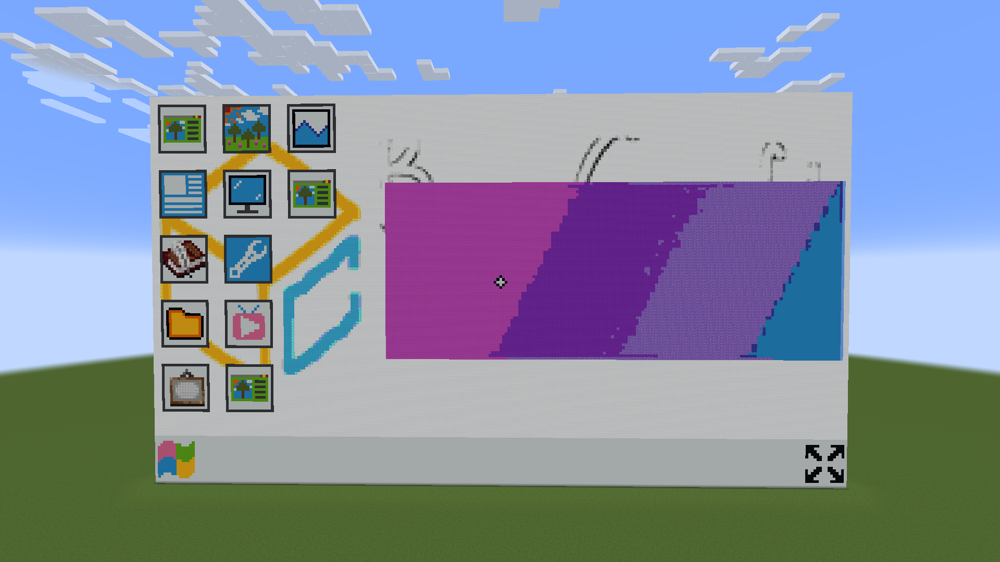

# MCBS Docs

MCBS（Minecraft Block Screen）是一个由 [back18](https://github.com/back18/) 编写的 Minecraft 服务器软件，可以帮助你在你的 Minecraft 服务器中添加一个 Minecraft 风格的屏幕。它使用 C# 编写，基于 AGPL-3.0 许可证开放其源代码。

https://github.com/back18/QuanLib
https://github.com/back18/QuanLib.Minecraft
https://github.com/back18/QuanLib.CommandLine

MCBS Docs is Powered by [BugCraft](https://bugcraft.org/) & [Docsify](https://docsify.js.org/)!
